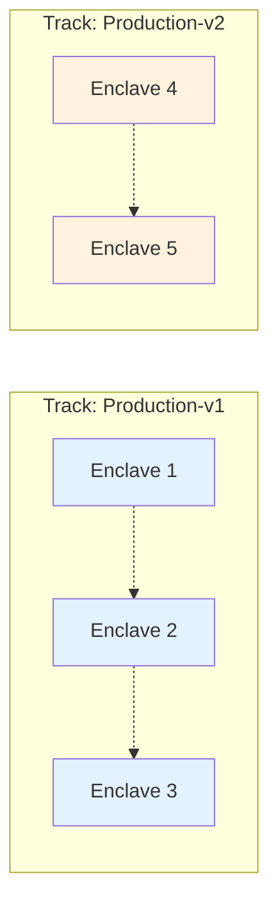
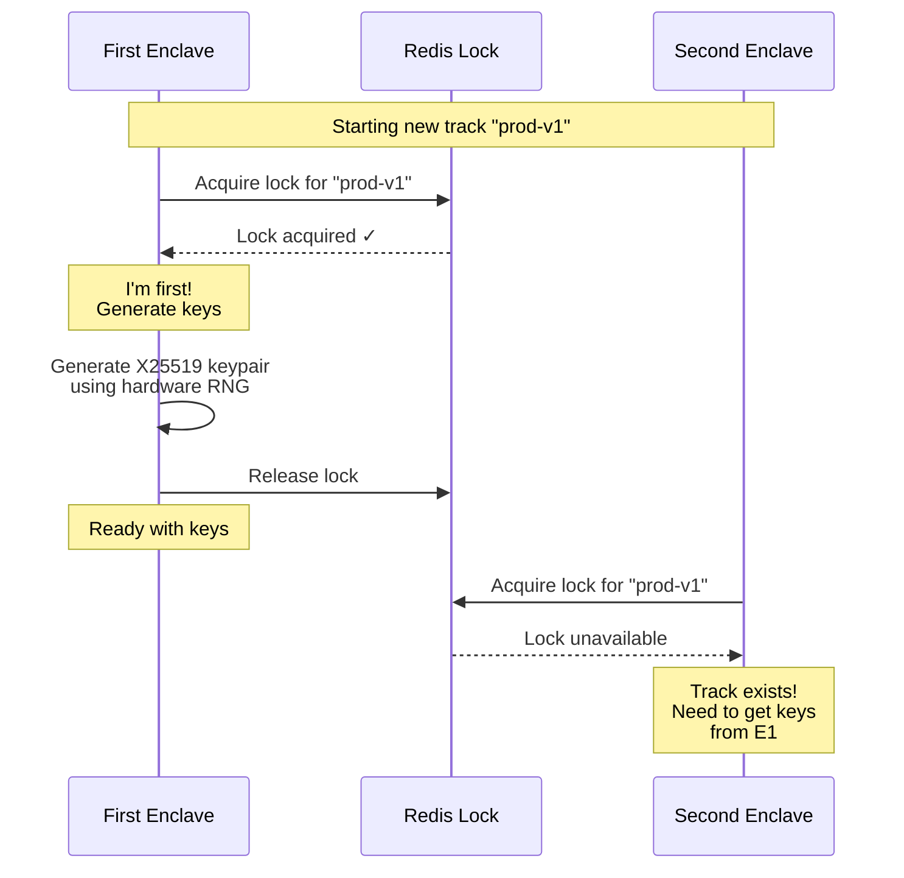
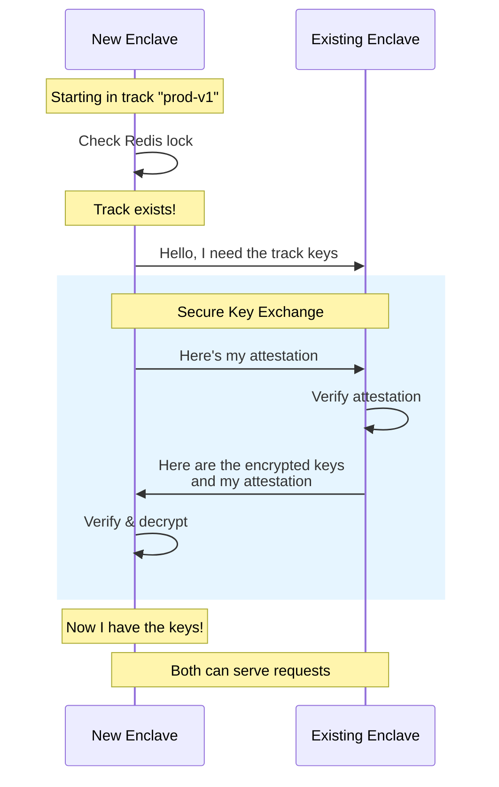
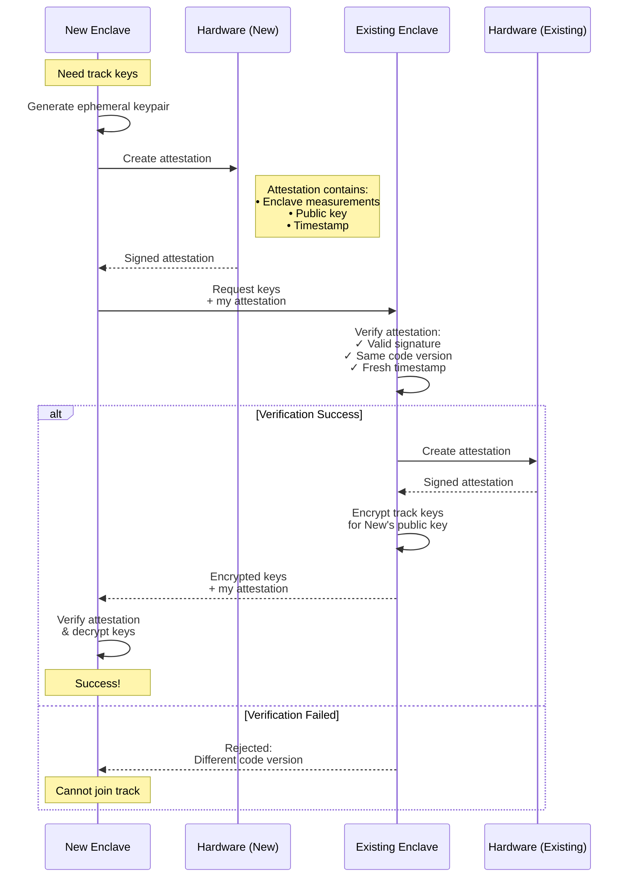
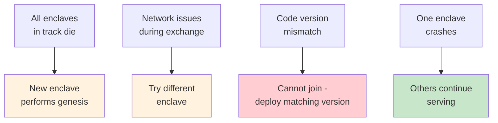

# Enclave Key Management

## Overview

This document describes how cryptographic keys are managed and distributed across AWS Nitro Enclaves in our system.

## Enclave Tracks

An **enclave track** is a group of enclaves that share the same cryptographic keys. This design enables:

- **Horizontal scaling** - Multiple enclaves can handle requests for the same data
- **High availability** - If one enclave fails, others in the track continue operating
- **Security isolation** - Different tracks have different keys, limiting blast radius

All enclaves within a track can decrypt the same push notification identifiers, but enclaves in different tracks cannot decrypt each other's data.

## Genesis: Creating a New Track

When a new track needs to be created, the first enclave to start becomes the **genesis enclave** and generates the cryptographic keys for that track.

**Key Points:**

- Redis distributed lock ensures only one genesis enclave per track
- Keys are generated using hardware random number generator (RNG)
- Keys exist only in the enclave's memory - never written to disk

## Joining an Existing Track

When a new enclave starts and finds that its track already exists, it must obtain the keys from an existing member of that track.

**Key Points:**

- New enclave discovers track already exists via Redis
- Keys are obtained directly from a running enclave
- Transfer is secured through attestation and encryption

## Secure Key Exchange

The secure key exchange is the critical security mechanism that ensures keys are only shared between legitimate enclaves running the same code.

### How It Works

### Why This Is Secure

**Key Security Properties:**

- **Code Identity**: PCR values ensure only enclaves running identical code can exchange keys
- **Hardware Root of Trust**: AWS Nitro hardware cannot be tampered with
- **Forward Secrecy**: Ephemeral keypairs are used once and destroyed
- **Memory-Only**: Keys never touch disk, only exist in protected RAM
- **Mutual Verification**: Both enclaves verify each other

## Failure Recovery

The system is designed to handle various failure scenarios:

## Summary

The key management system ensures that:

1. Each track has unique keys generated by the first enclave
2. New enclaves can securely join tracks by getting keys from peers
3. Only enclaves running identical, verified code can share keys
4. Keys never leave the secure enclave environment
5. The system continues operating even if individual enclaves fail

This design provides both security and scalability for managing encrypted push notification identifiers across a fleet of enclaves.

## Implementation Details

For developers looking to understand the implementation:

- [ **`secure-enclave-init`** ](../secure-enclave-init/src/main.rs) - Parent instance service that manages enclave lifecycle, handles Redis locking for genesis detection, and coordinates key distribution between enclaves
- [ **`/initialize` endpoint** ](../secure-enclave/src/pontifex_server/initialize.rs) - Enclave's initialization handler that receives configuration from parent, generates or retrieves track keys, and establishes the enclave's cryptographic identity
- [ **`/secret_key` endpoint** ](../secure-enclave/src/pontifex_server/secret_key.rs) - Returns the enclave's public key for client-side encryption and facilitates secure key exchange between enclaves in the same track
